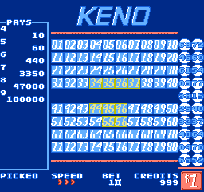
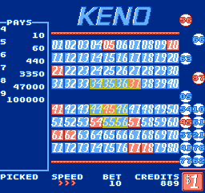
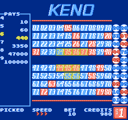

# NES Keno

A keno-style game implemented in 6502 assembly for the Nintendo Entertainment System (NES).

<p align="left">
  
  &nbsp;&nbsp;&nbsp;
  
  &nbsp;&nbsp;&nbsp;
  
</p>

## Overview

This project recreates a traditional keno machine experience on NES hardware, including number selection, adjustable betting, configurable speed, and a dynamic paytable display.

The goal is to select numbers, place a bet, and match drawn numbers to win credits according to the paytable.

---

## Gameplay

* Start with **1000 credits**
* Set your bet amount using **Up / Down**
* Navigate between controls using **Left / Right**
* Press **Start** to draw numbers
* Press **Start** again to begin the next round

---

## Controls

### Betting / Configuration Mode

* **Up / Down** – adjust bet amount
* **Left / Right** – move between:

  * Bet
  * Speed
  * Credits

#### Speed

* Press **A** to increase draw speed
* Cycles back to lowest speed when max is reached

#### Credits Adjustment

* Move to the desired digit
* Press **Up** to increment that digit
* Allows manual credit editing for testing or gameplay variation

---

### Number Selection Mode

* Press **Select** to toggle between:

  * Configuration mode
  * Number selection mode

* Use **D-Pad** to move around the board

* Press **A** to add/remove numbers

* Up to **10 numbers** can be selected

---

### Drawing

* Press **Start** to begin the draw
* Numbers are drawn automatically based on selected speed
* The **paytable highlights** the result based on matches

---

## Rules

* Standard keno rules
* Match selected numbers against drawn numbers
* Payout determined by:

  * number of picks
  * number of matches

---

## Features

* Full keno gameplay loop (bet → select → draw → payout → repeat)
* Configurable:

  * Bet amount
  * Draw speed
  * Credits
* Dynamic paytable highlighting
* Input-driven UI navigation
* Persistent credit tracking

---

## Technical Notes

* Written in 6502 assembly
* Designed for NES hardware constraints
* Implements:

  * menu/navigation system
  * numeric input handling
  * state-driven game flow
  * rendering of board and paytable

---

## Project Structure

```text id="m6k1c2"
code/   - Core game logic and rendering
data/   - Graphics data
tools/  - Assembler binaries and build tooling
```

---

## Build

This project uses **WLA-DX v9.3** as the assembler.

### Windows

```bat id="9df7s1"
build.bat
```

### Notes

* Required assembler binaries are included under `tools/`
* Newer versions of WLA-DX may not be syntax-compatible

---

## Notes

* Designed to mimic the behavior of a real keno machine
* Focuses on complete gameplay and UI interaction
* Code structure reflects the original development workflow with minimal refactoring
